# ChatGPT Web Midjourney Proxy - AI 上下文文档

> **文档版本**: v1.0.0
> **最后更新**: 2025-11-21 19:36:43
> **项目版本**: 2.25.3

---

## 变更记录 (Changelog)

| 日期 | 版本 | 变更内容 |
|------|------|----------|
| 2025-11-21 | v1.0.0 | 初始化 AI 上下文文档，完成项目架构扫描 |

---

## 项目愿景

这是一个集成多种 AI 服务的 Web 应用，基于 [ChenZhaoYu/chatgpt-web](https://github.com/Chanzhaoyu/chatgpt-web) 进行二次开发，整合了：

- **ChatGPT/GPTs**: 对话式 AI 服务，支持自定义 API key 和 base URL
- **Midjourney**: AI 绘图服务，支持文生图、图变、局部重绘、人脸替换等
- **Suno/Udio**: AI 音乐生成服务
- **Luma/Runway/Pika/Kling**: AI 视频生成服务
- **Viggle**: AI 舞蹈生成服务
- **Ideogram/Flux/DALL-E**: 多种 AI 绘图引擎
- **OpenAI Realtime**: 实时语音对话

项目目标是提供一个**统一的 AI 创作平台**，让用户通过一个 Web 界面访问多种 AI 能力。

---

## 架构总览

### 技术栈

**前端 (Frontend)**:
- Vue 3 + TypeScript
- Vite 4.x（构建工具）
- Pinia（状态管理）
- Naive UI（UI 组件库）
- Vue Router 4（路由）
- Tailwind CSS（样式）
- Vue i18n（国际化）

**后端 (Backend)**:
- Node.js + Express
- TypeScript
- ChatGPT API / Unofficial Proxy
- 多种 AI 服务代理（Midjourney, Suno, Luma 等）
- Multer（文件上传）
- AWS SDK（Cloudflare R2 存储）

**部署方式**:
- Docker（多阶段构建）
- Vercel（无服务器部署）
- Kubernetes（K8s 配置）

---

## 模块结构图

```mermaid
graph TD
    A["(根) chatgpt-web-midjourney-proxy"] --> B["前端模块 (src)"];
    A --> C["后端模块 (service)"];
    A --> D["部署配置"];
    A --> E["文档与资源"];

    B --> B1["核心框架"];
    B --> B2["业务视图"];
    B --> B3["API 层"];
    B --> B4["状态管理"];

    B1 --> B11["main.ts - 入口"];
    B1 --> B12["router - 路由"];
    B1 --> B13["plugins - 插件"];

    B2 --> B21["chat - 对话"];
    B2 --> B22["mj - 绘图"];
    B2 --> B23["suno - 音乐"];
    B2 --> B24["luma - 视频"];
    B2 --> B25["viggle - 舞蹈"];
    B2 --> B26["wav - 实时语音"];

    B3 --> B31["chat.ts"];
    B3 --> B32["mjapi.ts"];
    B3 --> B33["suno.ts"];
    B3 --> B34["luma.ts"];

    B4 --> B41["chatStore"];
    B4 --> B42["authStore"];
    B4 --> B43["settingStore"];

    C --> C1["服务入口"];
    C --> C2["中间件"];
    C --> C3["代理服务"];

    C1 --> C11["index.ts"];
    C1 --> C12["chatgpt/index.ts"];

    C2 --> C21["auth.ts"];
    C2 --> C22["limiter.ts"];

    C3 --> C31["myfun.ts - 多服务代理"];

    D --> D1["Dockerfile"];
    D --> D2["docker-compose"];
    D --> D3["kubernetes"];

    E --> E1["README.md"];
    E --> E2["CHANGELOG.md"];
    E --> E3["docs/"];

    click B "./src/CLAUDE.md" "查看前端模块文档"
    click C "./service/CLAUDE.md" "查看后端模块文档"
```



---

## 模块索引

| 模块名称 | 路径 | 职责 | 语言/框架 | 文档链接 |
|---------|------|------|-----------|----------|
| **前端** | `src/` | 用户界面、交互逻辑、API 调用 | Vue 3 + TypeScript | [./src/CLAUDE.md](./src/CLAUDE.md) |
| **后端** | `service/` | API 服务、代理转发、认证授权 | Express + TypeScript | [./service/CLAUDE.md](./service/CLAUDE.md) |

---

## 运行与开发

### 环境要求
- Node.js: `^16 || ^18 || ^19`
- pnpm: 推荐使用 pnpm 作为包管理器

### 本地开发

**前端开发**:
```bash
# 安装依赖
pnpm install

# 启动开发服务器（端口 1002）
pnpm dev

# 构建生产版本
pnpm build
```

**后端开发**:
```bash
cd service

# 安装依赖
pnpm install

# 启动开发服务器（端口 3002）
pnpm dev

# 构建生产版本
pnpm build

# 运行生产版本
pnpm prod
```

### Docker 部署

```bash
# 构建并运行
docker build -t chatgpt-web-mj .

docker run --name chatgpt-web-mj -d -p 6015:3002 \
  -e OPENAI_API_KEY=sk-xxxxx \
  -e OPENAI_API_BASE_URL=https://api.openai.com \
  -e MJ_SERVER=https://your-mj-server:6013 \
  -e MJ_API_SECRET=your-secret \
  ydlhero/chatgpt-web-midjourney-proxy
```

### Vercel 部署

点击一键部署按钮：

[](https://vercel.com/new/clone?repository-url=https://github.com/Dooy/chatgpt-web-midjourney-proxy&env=OPENAI_API_BASE_URL&env=OPENAI_API_KEY&env=MJ_SERVER&env=MJ_API_SECRET&project-name=chatgpt-web-midjourney-proxy&repository-name=chatgpt-web-midjourney-proxy)

---

## 环境变量配置

### 核心变量

| 变量名 | 说明 | 默认值 | 必填 |
|--------|------|--------|------|
| `OPENAI_API_KEY` | OpenAI API 密钥 | `sk-xxxxx` | 是 |
| `OPENAI_API_BASE_URL` | OpenAI API 基础 URL | `https://api.openai.com` | 否 |
| `OPENAI_API_MODEL` | 默认模型 | `gpt-3.5-turbo` | 否 |
| `MJ_SERVER` | Midjourney Proxy 服务地址 | - | 是（使用 MJ） |
| `MJ_API_SECRET` | Midjourney API 密钥 | - | 否 |
| `SUNO_SERVER` | Suno API 服务地址 | - | 是（使用 Suno） |
| `SUNO_KEY` | Suno API 密钥 | - | 否 |
| `LUMA_SERVER` | Luma API 服务地址 | - | 是（使用 Luma） |
| `LUMA_KEY` | Luma API 密钥 | - | 否 |

### 安全与访问控制

| 变量名 | 说明 | 默认值 |
|--------|------|--------|
| `AUTH_SECRET_KEY` | 访问授权密码 | 无 |
| `AUTH_SECRET_ERROR_COUNT` | 防爆破：错误次数限制 | 无 |
| `AUTH_SECRET_ERROR_TIME` | 防爆破：锁定时间（分钟） | 无 |

### 功能开关

| 变量名 | 说明 | 默认值 |
|--------|------|--------|
| `API_UPLOADER` | 是否开启文件上传 | 关闭 |
| `HIDE_SERVER` | 前端是否隐藏服务端配置 | 关闭 |
| `DISABLE_GPT4` | 是否禁用 GPT-4 | 关闭 |
| `MENU_DISABLE` | 禁用的菜单项（逗号分隔）| 无 |

完整环境变量列表请参考 [README.md](./README.md)。

---

## 测试策略

### 现状
- **单元测试**: 无
- **集成测试**: 无
- **E2E 测试**: 无

### 推荐
1. **前端测试**: 使用 Vitest + Vue Test Utils 进行组件测试
2. **后端测试**: 使用 Jest 进行 API 端点测试
3. **E2E 测试**: 使用 Cypress 或 Playwright

---

## 编码规范

### Linting
- **ESLint**: 使用 `@antfu/eslint-config`
- **运行检查**: `pnpm lint`
- **自动修复**: `pnpm lint:fix`

### Commit 规范
- 使用 **Commitlint** + **Conventional Commits**
- Husky pre-commit hook 会自动运行 lint-staged

### TypeScript
- **严格模式**: 启用
- **路径别名**: `@/` 映射到 `src/`

---

## AI 使用指引

### 项目结构建议

当需要 AI 协助开发时，建议关注以下关键文件：

**前端开发**:
- `src/api/`: 所有 API 调用逻辑
- `src/views/`: 各业务模块的视图组件
- `src/store/`: Pinia 状态管理
- `src/router/`: 路由配置

**后端开发**:
- `service/src/index.ts`: Express 主入口，所有路由定义
- `service/src/chatgpt/`: ChatGPT API 封装
- `service/src/myfun.ts`: 各种 AI 服务代理函数
- `service/src/middleware/`: 认证与限流中间件

### 常见任务

**添加新的 AI 服务**:
1. 在 `service/src/myfun.ts` 添加代理函数
2. 在 `service/src/index.ts` 添加路由
3. 在 `src/api/` 添加前端 API 调用
4. 在 `src/views/` 添加对应的 UI 界面
5. 在 `src/router/index.ts` 添加路由

**修改 UI 样式**:
- 主题配置: `src/store/modules/app/`
- 全局样式: `src/assets/`
- Tailwind 配置: `tailwind.config.js`

---

## 关键数据流

### ChatGPT 对话流程
```
用户输入 → src/views/chat/index.vue
         → src/api/chat.ts (fetchChatAPIProcess)
         → service/src/index.ts (/chat-process)
         → service/src/chatgpt/index.ts (chatReplyProcess)
         → OpenAI API
         → 流式返回 → 前端逐步渲染
```

### Midjourney 绘图流程
```
用户提交 → src/views/mj/draw.vue
         → src/api/mjapi.ts (subTask)
         → service/src/index.ts (/mjapi/*)
         → Midjourney Proxy 服务
         → 轮询任务状态 (flechTask)
         → 显示结果
```

---

## 已知问题与限制

1. **无自动化测试**: 缺乏单元测试和集成测试
2. **状态管理复杂度**: 部分状态在 localStorage 和 Pinia 之间同步，需注意一致性
3. **错误处理**: 部分 API 调用缺少完善的错误边界处理
4. **类型安全**: 部分 API 响应类型使用 `any`，需逐步完善

---

## 贡献指南

请参考 [CONTRIBUTING.md](./CONTRIBUTING.md)

---

## 许可证

MIT © [Dooy](./license)

---

## 相关链接

- **GitHub 仓库**: https://github.com/Dooy/chatgpt-web-midjourney-proxy
- **在线演示**: https://vercel.ddaiai.com
- **Midjourney Proxy**: https://github.com/novicezk/midjourney-proxy
- **Suno API**: https://github.com/SunoAI-API/Suno-API
- **Luma API**: https://github.com/LumaAI-API/Luma-API

---

**下次扫描建议**:
1. 深入分析 `src/views/` 各模块的组件结构
2. 补充各 AI 服务的详细集成文档
3. 建立完善的测试策略
4. 优化类型定义，减少 `any` 使用
